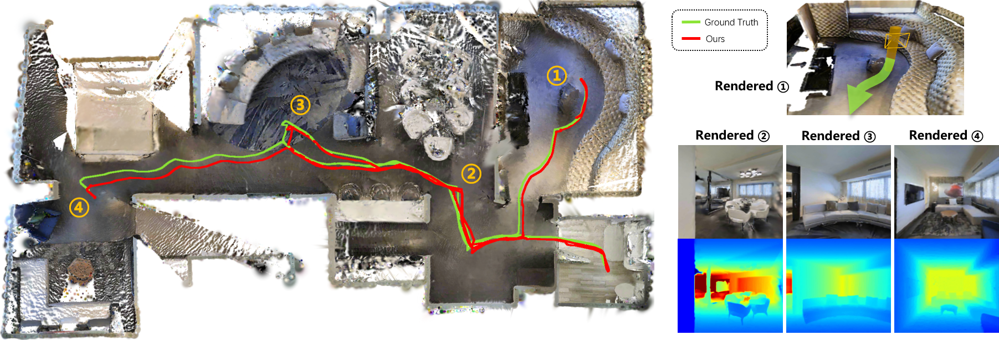

# LightSplat

<h3 align="center">
  Real-Time High-Fidelity 3D Gaussian SLAM with Loop Closure
</h3>

<p align="center">
  Junze Bao, Ye Gao, Yiming Huang, Xiaolong Yu, Chen Dong, Qing Gao, Wei Wang, Jinhu Lv
  <br>
  <strong>IEEE/RSJ International Conference on Intelligent Robots and Systems (IROS), 2026</strong>
</p>

<p align="center">
  <a href="#"><strong>Paper</strong> (coming soon)</a>
</p>

<!-- Replace the placeholder link above after the paper is public. -->

<p align="center">
  
</p>

**LightSplat** is a real-time RGB-D SLAM system for high-fidelity 3D Gaussian
mapping in practical indoor scenes. It couples a lightweight local-feature
front-end with dense Gaussian submap reconstruction and online loop closure,
bringing the efficiency of feature-based tracking into a 3DGS SLAM pipeline.

## News

- **2026.06** LightSplat was accepted to IEEE/RSJ IROS 2026.
- Code and documentation will be continuously updated.

## Highlights

- Real-time RGB-D tracking with a LightGlue-based visual front-end.
- Dense, high-fidelity scene reconstruction with 3D Gaussian submaps.
- Online loop closure through feature-accelerated Gaussian registration.
- Support for TUM RGB-D, Replica, ScanNet, and RealSense/ROS input.

## Setup

Clone the repository with its submodules:

```bash
git clone --recursive https://github.com/saguru23/LightSplat.git
cd LightSplat
git submodule update --init --recursive
```

Create the environment with CUDA 11.8, then install the Python dependencies:

```bash
conda create -n lightsplat python=3.10 -y
conda activate lightsplat

conda install -c nvidia/label/cuda-11.8.0 cuda=11.8 cuda-toolkit=11.8 cuda-nvcc=11.8 -y
conda install pytorch==2.1.2 torchvision==0.16.2 pytorch-cuda=11.8 faiss-gpu=1.8.0 -c pytorch -c nvidia -y

pip install -r requirements.txt
pip install -e thirdparty/Hierarchical-Localization
pip install -e thirdparty/LightGlue
```

## Dataset Download

Download TUM RGB-D:

```bash
bash scripts/download_tum.sh
```

Download Replica:

```bash
bash scripts/download_replica.sh
```

The scripts place datasets under `data/`. After downloading, edit the config file
and set the correct sequence path:

```yaml
data:
  input_path: data/TUM_RGBD-SLAM/rgbd_dataset_freiburg1_desk
  output_path: output/tum_rgbd_desk
```

For ScanNet, RealSense, or ROS input, update the corresponding config file
manually.

## Run

Run the full SLAM pipeline:

```bash
python run_slam.py configs/tum_rgbd.yaml
```

Run only the LightGlue front-end:

```bash
python -m src.tools.run_slam configs/tum_rgbd.yaml
```

## Acknowledgements

This project builds on [Gaussian-SLAM](https://github.com/VladimirYugay/Gaussian-SLAM)
and [LoopSplat](https://github.com/GradientSpaces/LoopSplat). We thank the authors
for their open-source work.

## License

This project is released under the MIT License. See `LICENSE` for details.
